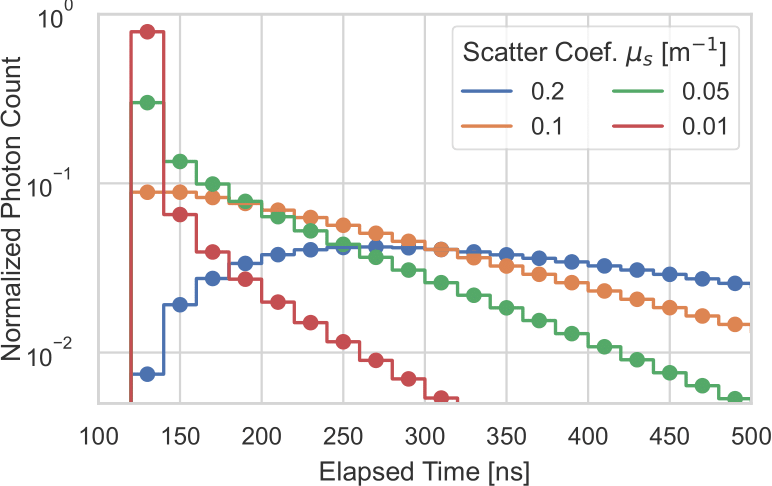

# Theia Overview

Theia is a package for creating Monte Carlo simulation of optionally polarized
light propagation through volumes of arbitrary shapes containing
(non-)scattering media while keeping track of the elapsed time. This includes
physically correct reflections and transmission at their boundaries. The
simulation runs on the GPU utilizing dedicated ray tracing hardware found on
modern ones for increased performance.

This package allows through its modular design maximal flexibility in
defining simulations. While this also includes the produced results, usually
one wants to produce _light curves_ describing the expected signal at the
detector as function of time:

This documentation aims to give insight to the broader concepts underlying this
package and photon tracing in general.
