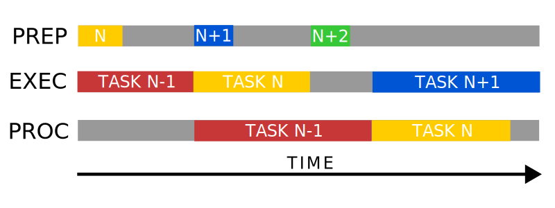

# Pipeline Components

Pipelines are a concept inherited from `hephaistos` the underlying framework
handling GPU related things and is independent from the simulation algorithm.
Conceptually, pipelines are a sequence of stages each performing an individual
configurable task that may depend on the result of previous stages and usually
involve the GPU. The trick with pipelines is that they are double buffered
allowing to process a previous result and prepare the next task while the GPU
is still busy.

Usually, pipelines consists of three components:

- Pipeline stages are the building blocks that make up a pipeline. They
  encapsulate a logical unit or task providing an interface to configure
  and manage it.
- Pipelines consist of a sequence of stages providing a single point to manage
  them.
- Schedulers take a pipeline and orchestrate the submission of work to the GPU
  as well as preparing and processing of the same on the CPU side. They are
  optional but strongly recommended for better performance.

In the following we will take a closer look into each component.

## Pipeline Stage

As the smallest logical unit in a pipeline, pipeline stages encapsulate a single
task. This can be as simple as copying data to or from the GPU or as complex as
running GPU code. It is responsible to manage the double buffered resources
needed for parallelism (config 0 and config 1), although resources may be shared
if it is save to do so (e.g. program code or readonly memory).

During the creation of a pipeline it will call the `run` function on all of its
stages twice for each configuration. This returns a sequence of commands[^1] to
be run on the GPU and may be empty. Since this only happens once the Pipeline
always issues the same commands to the GPU. Alterations happens solely through
memory containing e.g. data or program parameters. Before each run of the
pipeline the scheduler calls the `update` function notifying the pipeline stages
which configuration is safe to update.

[^1]: In the Vulkan API used to interact with the GPU commands are recorded in
      buffers before they are sent to the GPU in a single. Pipelines reuse them
      for better performance.

The parameters of a stage are exposed through `getParams` and `setParams`
methods used by pipelines. The former returns a dictionary mapping parameter
names to their values while the latter takes such a dictionary to update the
stage's internal state. This state can then later be used to update
configuration on the GPU as mentioned earlier.

## Pipeline

Pipelines manages a sequence of pipeline stages ensuring they will run on the
GPU in order. During initialization they collect the commands from each stage
and create for each config a subroutine[^2] that can later be used to issue
single runs of the pipeline through calls of `run` or `runAsync`.

[^2]: Subroutines are reusable command buffers used within `hephaistos`.

Analogue to the stages, pipelines also provide a `getParams` and `setParams`
method to get or alter the state of its stages. The individual parameters are
addressed by appending the parameter name with the name of the corresponding
stage in the format `stage__parameter`. Stages are either addressed by
the name passed during the creation of the pipeline or by their default name
defined by the stage.

## Pipeline Scheduler

Pipeline scheduler orchestrate the submission of work onto pipelines. It takes a
list of tasks, which consist of a dictionary that gets passed to the pipeline's
`setParams` function to alter its state before each run. The current progress
can be queried via the `tasksFinished` property. Alternatively, calling the
`wait` function blocks the caller until all tasks have finished.

An optional process function provided to the scheduler will be called after
each task finishes. The scheduler will wait for this function to return before
issuing the next task using the same pipeline configuration. That is while e.g.
config 0 is being processed config 1 can still be used by the GPU, but the next
task that needs to run using config 0 again waits for the process function.

!!! tip
    To not stall the GPU and thus hurt the performance the process function
    should be kept simple, e.g. copying the result for further processing later.

To achieve maximum parallelism, the scheduler runs background threads handling
updating the pipeline and processing the results if such a function was passed
to the scheduler. The GPU will wait on both threads to finish for a given
config. Note that updating and processing happens in parallel and should
therefore not alter the same memory. One can think of running a task proceeding
in three steps each happening on its own thread including the GPU. First it gets
prepared before passing it to the GPU for execution and optionally its results
are finally processed. These steps are the ones that get parallelized as
illustrated in the following graphic:

