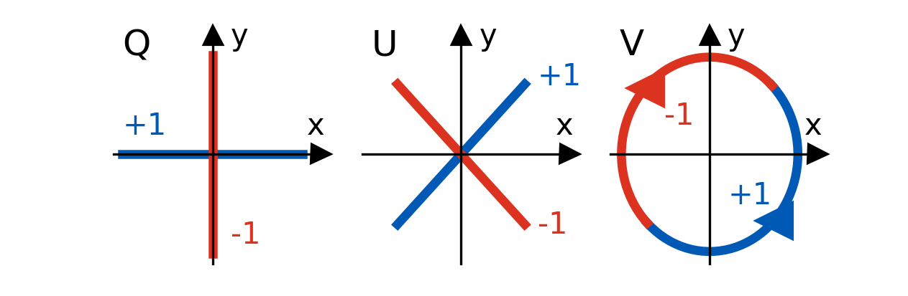

# Polarization

Polarization provides an extra dimension of information especially if the light
source itself if (partially) polarized. Even if the detector does not directly
measure polarization it is usually still sensitive to it by means of the Fresnel
equations governing the transmission of light at the medium/detector interface.

!!! danger "Experimental Status"
    Support for simulating polarization is considered experimental as they are
    no tests beyond rather simplistic ones that check the physical soundness of
    the implementation.

## Physical Model

The physics behind polarization takes some time to explain. Luckily, the method
used to model it allows a intuitive understanding. The polarization of a light
ray is described using a [Stokes vector](https://en.wikipedia.org/wiki/Stokes_parameters)
$S = (I, Q, U, V)$. Its first parameter equals to the classic radiance, while
the remaining ones describe the polarization. The exact value of the stokes
parameter depend on the chosen coordinate system or reference frame
perpendicular to the light's propagation direction (here z):

Changes in polarization caused by scattering in volume or at volume boundaries
are described by [Mueller matrices](https://en.wikipedia.org/wiki/Mueller_calculus#Mueller_matrices):

$$
\begin{pmatrix}I' \\ Q' \\ U' \\ V'\end{pmatrix} =
\begin{pmatrix}
m_{11} & m_{12} & m_{13} & m_{14} \\
m_{21} & m_{22} & m_{23} & m_{24} \\
m_{31} & m_{32} & m_{33} & m_{34} \\
m_{41} & m_{42} & m_{43} & m_{44}
\end{pmatrix} \cdot
\begin{pmatrix}I \\ Q \\ U \\ V\end{pmatrix}
$$

Like the stokes vector, the mueller matrix also depends on the chosen reference
frame. Theia generally choses here the plane of scattering or incidence, i.e.
the plane in which both the incident and scattered direction lies.

Theia further assumes that the simulated media shows some symmetries such as
isotropy. This holds for most media including water and reduces the degrees of
freedom in the Mueller matrix:

$$
\mu_s \cdot
\begin{pmatrix}
     1 & m_{12} & 0 & 0 \\
m_{12} & m_{22} & 0 & 0 \\
     0 &      0 & m_{33} & m_{34} \\
     0 &      0 & -m_{34} & m_{33}
\end{pmatrix}
$$

## Polarized Simulation

Polarization can be enabled in simulation by passing `polarized=True` when
creating a [tracer](pipeline/components.md#tracer). This causes light rays
sampled from the light source and in forward tracing to carry a Stokes
vector and reference frame denoted by its y axis. Similarly for backward tracing,
rays traced or sampled from camera carry alongside the reference frame an
(accumulated) Mueller matrix. Both tracing modes will in the end produce a
polarized hit. This also carries a reference frame and a Stokes vector
normalized to the $I$ parameter, thus the radiance contribution is still stored
in the `contrib` parameter. As mentioned before, theia always chooses the
reference frame as the plane of incidence, with y-axis normal to it. This allows
to directly apply e.g. the Fresnel equations without checking the reference
frame.
