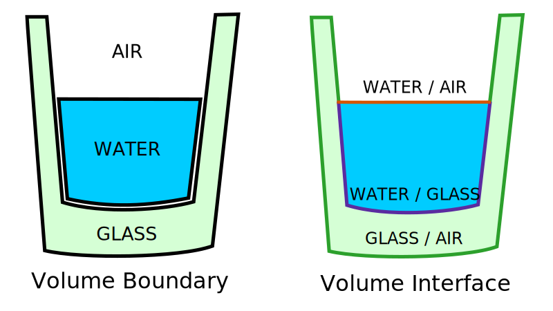

# Scene

Scenes describe the environment within light is traced. It at least consists of
a single medium describing the optical properties such as absorption and
scattering, but can also contain arbitrary geometries to simulate accurate
reflection and refraction between multiple media.

!!! info
    The creation of scenes require ray tracing capable hardware. You can however
    always create media for use in volume tracers.

## World and Object Space

The simulation uses two different coordinate system: The world space is the one
within light rays are traced whereas the object space is used when interacting
with meshes such as targets. These are related through an (affine)
transformation matrix. The idea behind this is to make the reported hit position
and direction independent of the exact position and orientation of the
corresponding target. This way we do not have to create a distinct
[hit response](pipeline/components.md#hit-response) for each target or change it
when a target moves.

## Scene Components

Scenes consist of various components as introduced in the following:

### Medium

Medium describes its optical properties over a wavelength range defined by
`lambdaMin` and `lambdaMax`. The range is used to clamp and normalize
wavelengths before querying the look-up tables that store the actual data.
It contains the following properties as function of the wavelength that will be
replaced by a default value if not present:

- Refractive index (default 1.0)
- Group velocity (default 1.0c)
- Absorption coefficient (default 0.0)
- Scattering coefficient (default 0.0)

Sampling and evaluating the scattering [phase function](model.md#volume-scattering)
are handled by two additional look-up tables, where we denote $\cos\theta$ as
the cosine of the angle between the incident and scattered ray direction.

- Log phase function: Takes $\cos\theta$ and returns the logarithm of the phase
  function.
- Phase sampling: Takes a uniform random number in the range [0,1) and returns
  $\cos\theta$.

For simulating the change in polarization caused by scattering events there are
additionally tables for the elements of the corresponding
[mueller matrix](polarization.md#mueller-matrices) $m_{12}$, $m_{22}$, $m_{33}$
and $m_{34}$ as function of $\cos\theta$.

If one wants to implement analytical methods of these properties instead one
can derive from `MediumModel` and override the corresponding functions. A call
of `creteMedium` will then create the look-up tables by sampling the functions
over the given wavelength range. The reason why we prefer look-up tables over
analytical models is that this way we have a single common code path on the GPU
resulting in a better performance and also allows to directly use measured data.

### Meshes and Volume Border

A scene usually contains various volumes each containing a different medium that
are separated by volume borders. These volume borders are defined by meshes
which are made out of triangles. Using triangles means that smooth surfaces can
only be approximated by increasing the number of triangles, but are necessary
for taking full advantage of hardware accelerated ray tracing.

Meshes are generally defined in their respective object space allowing them to
be referenced multiple times. Each reference comes with their own transformation
used to place the mesh in the world.

Note that unlike most 3D software meshes do not delimit the boundaries of a
single medium, but denote the interfaces between them. This especially means
that we need to split a mesh into separate parts for each kind of volume
interface. For instance, the water in a glass needs two meshes: One for the
water-air and a second for the water-glass interface. This way we only need to
perform a single ray-triangle intersection to know which medium the ray enters
after transmission compared to two with the classic volume borders thus
ultimately increasing performance.



!!! note
    Meshes do not model a single medium but the boundaries between them!

### Materials

Meshes only define the boundaries but not the medium they separate. This is
achieved with materials. By defining that the surface normal of the mesh points
from inside to the outside, we can distinguish between the two volumes and
assign a medium to them. In addition to that, two sets of flags gives the tracer
information about how to proceed. Each set is responsible for one direction:
Either for rays encountering the border from the inside medium or from the
outside medium. Currently the following flags exist:

- `BLACK_BODY`: Rays are absorbed stopping tracing immediately.
- `DETECTOR`: Indicates hits may produce a response.
- `NO_REFLECT`: Disables reflection at this boundary.
- `NO_TRANSMIT`: Disables transmission at this boundary.
- `VOLUME_BORDER`: Only transmission without refracting the ray's direction.

## Creating a Scene

Before a scene can be created its building blocks needs to be uploaded to the
GPU. `MaterialStore` handles the uploading of media and material, while
`MeshStore` handles the preparation of meshes. Both of them are immutable in the
sense that you cannot add additional entries after they are created, although
it is possible to use multiple stores. Additionally, if the `freeze` flag is set
to `False`, `MaterialStore` allows to update the contents of the look-up tables
used by the media as long as they do not increase in size.

Once the building blocks are available on the GPU, they can be used to build a
scene. To do so you create instances of your meshes, assign a material to them
and place them in space with a dedicated transformation. This way multiple
instances can share mesh and/or materials between them. Both materials and
meshes can be referenced by their assigned name. Finally, the scene requires a
boundary box used to determine when rays are "lost", i.e. to far away to be
worth further tracing, as well as an outermost medium the whole scene is emerged
in, e.g. water, which is used to initialize the rays from the light source in
forward tracing.

The following shows a code example on how the creation of a scene may look like:

```python title="How to create a scene"
from theia.material import BK7Model, Material, MaterialStore, WaterBaseModel
from theia.scene import MeshStore, RectBBox, Scene, Transformation
import theia.units as u # (1)!

# create materials
water = WaterModel(4.0, 10_000, 35.0).createMedium()
glass = BK7Model().createMedium()
mat = Material("mat", glass, water, flags=("DR", "B")) # (2)!
# make material available to GPU
matStore = MaterialStore([mat])

# load meshes
meshStore = MeshStore({
  "cube": "meshes/cube.ply", # (3)!
  "sphere": "meshes/sphere.stl",
})

# create mesh instances
det0 = meshStore.createInstance(
  "sphere", "mat", # (4)!
  Transform.TRS(scale=0.4 * u.m, translate=(10.0, 0.0, 50.0) * u.m),
  detectorId=0,
)
det1 = meshStore.createInstance(
  "sphere", "mat",
  Transform.TRS(scale=0.4 * u.m, translate(10.0, 0.0, -50.0) * u.m),
  detectorId=1, # (5)!
)

# create scene
scene = Scene(
  [det0, det1],
  matStore.material,
  medium=matStore.media["water"],
  bbox=RectBBox((-1.0 * u.km, ) * 3, (1.0 * u.km, ) * 3),
)
```

1. Theia provides a unit system for better readability.
2. These flags denote, that from the outside it acts as detector and only allows
   reflection, whereas from the inside it absorbs all light.
3. You can load meshes by simply passing the path to the corresponding file.
4. We reference both the mesh and the material by their assigned name. `Scene`
   will later resolve these.
5. We assigned each detector its own id that can later be used to select which
   detector becomes active during tracing.
