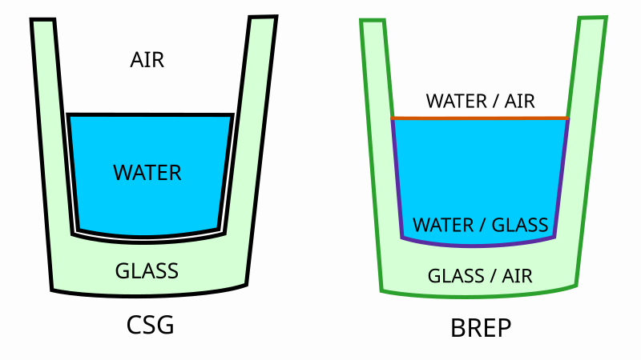

# Meshes

A scene usually contains various volumes each containing a different medium that
are separated by volume borders. Theia utilizes hardware accelerated ray tracing
for fast border intersection calculations. This already dictates some
design decision to make the most out of it:

- **Triangle Meshes**:  
Theia uses triangle meshes instead of parametric
surfaces. While hardware ray tracing supports both, only triangle intersection
are fully accelerated.
- **Boundary Representation**  
Volumes are not defined directly but by by their enclosing surfaces.

This differs from one might be used from e.g. `Geant4`, where parametric volumes
are used instead.

## Boundary Representation

Theia defines volumes by their enclosing surfaces using an approach known as
_boundary representation_ or _BREP_. This differs from the perhaps more
intuitive _contractive solid geometry_ (_CSG_), where complex volumes are
constructed by combinding simpler ones. The difference can be easiest described
using an example:



To construct a glass of water using CSG, we would define glass and a water
solid. Everything outside both solids would be defined to be air. In BREP we
have to instead define the interfaces between water and air, water and glass,
as well as between glass and air.

!!! info
    Meshes do not model a single medium but the boundaries between them!

The two sides of a boundary can be uniquely identified using the winding order
of the underlying triangle mesh. The three vertices of each triangle can be
sequenced in either clock-wise or counter-clock-wise order. Both order transform
into each other upon flipping the triangle, thus uniquely identifying both sides
and in consequence both volumes.

!!! warning
    Ensure the right winding order of triangle meshes to not assign the wrong
    volumes to each side!

Since BREP defines volumes implicitly, it is possible for a single volume to not
be completely closed. Theia can tolerate these errors to a certain degree. It
keeps track through which medium a ray is currently propagated and discards any
if a surface disagrees with that. This is however not a bulletproof method and
wrong results may still be produced unnoticed.

!!! warning
    Make sure volumes are properly closed!

## Loading Meshes

Theia uses [trimesh](https://github.com/mikedh/trimesh) to load most common
file formats via `theia.scene.loadMesh`. To load or create a mesh manually, you
have to populate a `hephaistos.Mesh` structure consisting of the vertices and
optionally indices referencing them to form triangles. If no indices are given,
every three consecutive vertices form a triangle. Vertices need to be 2D numpy
arrays with the first three columns being the x, y and z coordinate.

```python
import numpy as np

from theia.scene import loadMesh
from hephaistos import Mesh

# load mesh from disk
sphere = loadMesh("sphere.stl")
cone = loadMesh("cone.obj")

# procedurally create a cube
cube = Mesh()
cube.vertices = np.array([
    [-1.0, -1.0,  1.0],
    [ 1.0, -1.0,  1.0],
    [ 1.0,  1.0,  1.0],
    [-1.0,  1.0,  1.0],
    [-1.0, -1.0, -1.0],
    [ 1.0, -1.0, -1.0],
    [ 1.0,  1.0, -1.0],
    [-1.0,  1.0, -1.0],
], dtype=np.float32)
cube.indices = np.array([
    # Front face
    [0, 1, 2],
    [2, 3, 0],
    # Right face
    [1, 5, 6],
    [6, 2, 1],
    # Back face
    [5, 4, 7],
    [7, 6, 5],
    # Left face
    [4, 0, 3],
    [3, 7, 4],
    # Top face
    [3, 2, 6],
    [6, 7, 3],
    # Bottom face
    [4, 5, 1],
    [1, 0, 4],
], dtype=np.uint32)
```

Meshes used in a scene need to be preprocessed to allow for hardware accelerated
ray tracing. This happens in `theia.scene.MeshStore`. It expects a dictionary
giving each mesh a name. Instead of a `hephaistos.Mesh`, you can also provide
the path to a file containing the mesh:

```python
from theia.scene import MeshStore

meshes = MeshStore({
    "sphere": "sphere.stl",
    "cone": "cone.obj",
    "cube": cube,
})
```

Later `MeshStore` is used to create one or multiple instances of each mesh,
which are subsequently places in scene.
